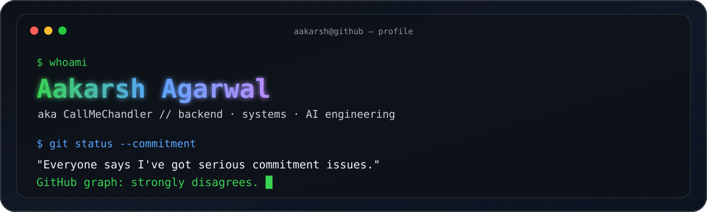
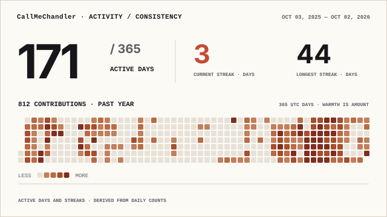

<div align="center">

<picture>
  <source media="(prefers-color-scheme: dark)" srcset="./assets/hero-dark.svg">
  <source media="(prefers-color-scheme: light)" srcset="./assets/hero-light.svg">
  
</picture>

<br>

<a href="https://git.io/typing-svg">
  
</a>

</div>

---

### `~/about`

```txt
$ cat about.txt

I like software most when I can understand what sits underneath it.

So I build across the stack:
  → low-level systems and C++ backends
  → full-stack products people can actually use
  → ML / AI systems when the problem deserves it

Current operating mode: build > break > understand > rebuild better.
```

### `~/featured`

<table>
<tr>
<td width="50%" valign="top">

#### 🧠 [NeuralKernel](https://github.com/CallMeChandler/NeuralKernel)
**A from-scratch 32-bit x86 operating system with a neural runtime.**

Multiboot2 boot path, paging, heap, Ring 3 userspace, ELF loading, syscalls, custom NKFS filesystem, scheduler, shell, editor, plus Q8.8 neural inference for scheduling, page scoring, anomaly detection and conversational kernel control.

`C++` `NASM` `x86` `OS` `QEMU` `Neural Inference`

</td>
<td width="50%" valign="top">

#### ⚖️ [Online Judge](https://github.com/CallMeChandler/online-judge-cpp)
**A competitive-programming judge built from scratch in C++20.**

HTTP submissions enter an asynchronous worker pool, compile with `g++`, execute inside forked Linux child processes, enforce time limits, compare output and persist verdicts without blocking request threads.

`C++20` `Crow` `fork/exec` `Concurrency` `Linux`

</td>
</tr>

<tr>
<td width="50%" valign="top">

#### 🖥️ [Aakarsh XP](https://github.com/CallMeChandler/aakarsh-xp)
**My portfolio, except apparently it shipped with Windows XP.**

A desktop-style interactive portfolio with a working Start menu, taskbar, terminal, Internet Explorer, Notepad, media player, games, documents and shutdown flow.

`React` `Frontend` `Interactive UI` `Personal Brand`

</td>
<td width="50%" valign="top">

#### 🏠 [HostelHive](https://github.com/CallMeChandler/HostelHive)
**A full-stack hostel operations platform built for students and admins.**

Complaint workflows, mess menus, sports inventory, circulars, profiles, JWT authentication and role-based access across a responsive React + Node/Express + MongoDB stack.

`React` `Node.js` `Express` `MongoDB` `JWT`

</td>
</tr>

<tr>
<td width="50%" valign="top">

#### 💸 [PricePilot](https://github.com/CallMeChandler/pricepilot-nextjs)
**A full-stack price comparison product in one Next.js application.**

Normalized multi-source comparisons, secure sessions, per-user saved data, payment-reward recommendations, stale-request cancellation, optimistic UX and durable Vercel Blob persistence.

`Next.js` `TypeScript` `React` `Zod` `Vercel`

</td>
<td width="50%" valign="top">

#### 🧮 [CIFAR-10 DNN](https://github.com/CallMeChandler/DNN_cifar10)
**Deep learning without hiding behind autodiff.**

A multilayer neural network implemented manually in NumPy with forward/backprop, stable softmax, cross-entropy, He initialization, momentum and regularization, then benchmarked against Keras.

`Python` `NumPy` `TensorFlow` `Backpropagation` `ML`

</td>
</tr>
</table>

---

### `~/toolbox`

<div align="center">


</div>

<br>

```txt
languages     C++ • Python • JavaScript • TypeScript • SQL
backend       Node.js • Express • REST • auth • concurrency • Linux APIs
systems       C++20 • processes • threads • memory • OS fundamentals
ai / ml       NumPy • PyTorch • TensorFlow • classical ML
shipping      Git • GitHub Actions • Docker • AWS • Vercel
```

---

### `~/commitment-issues`

<div align="center">

<h3>Everyone says I've got serious commitment issues.<br>My GitHub graph says otherwise.</h3>

<p><i>800+ commits/contributions in the last year and still somehow finding new things to build.</i></p>

<picture>
  <source media="(prefers-color-scheme: dark)" srcset="./profile/activity-consistency-wide-dark.svg">
  <source media="(prefers-color-scheme: light)" srcset="./profile/activity-consistency-wide-light.svg">
  
</picture>

<br><br>

<picture>
  <source media="(prefers-color-scheme: dark)" srcset="https://raw.githubusercontent.com/CallMeChandler/CallMeChandler/output/github-snake-dark.svg">
  <source media="(prefers-color-scheme: light)" srcset="https://raw.githubusercontent.com/CallMeChandler/CallMeChandler/output/github-snake.svg">
  
</picture>

</div>

---

### `~/status`

```yaml
focus:
  - backend engineering
  - systems
  - AI application engineering

bias:
  toward: "building things from scratch"
  against: "black boxes I don't understand"

debugging_strategy:
  step_1: "stare at logs"
  step_2: "question every life decision"
  step_3: "find the missing semicolon"
```

<div align="center">

**`callmechandler@github:~$`** <kbd>still building</kbd> █

<br><br>

<a href="https://github.com/CallMeChandler">
  
</a>
<a href="https://www.linkedin.com/in/aakarsh-agarwal-7579061a8/">
  
</a>

</div>
